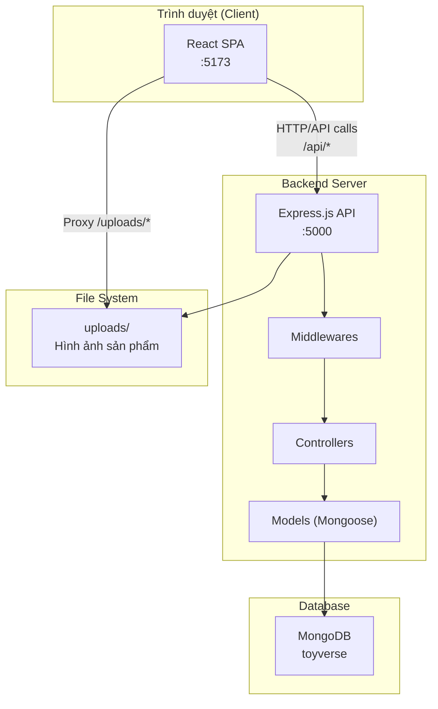
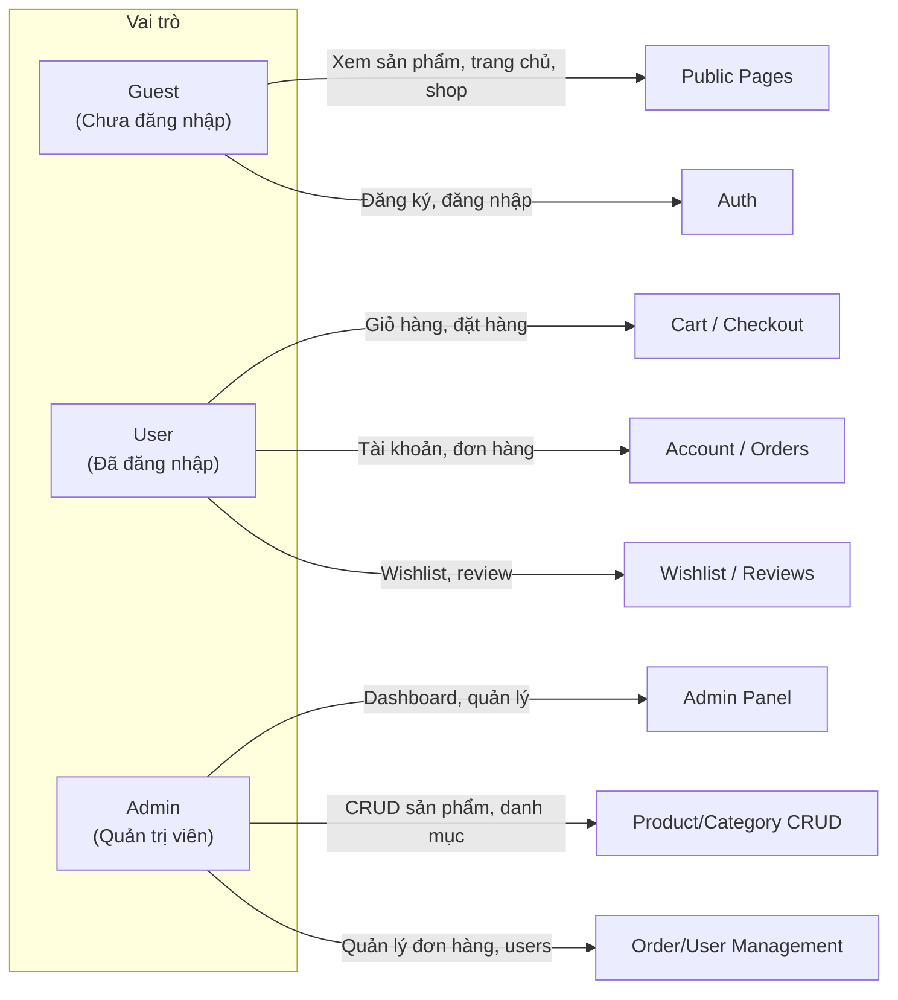

# 📋 BÁO CÁO CHI TIẾT DỰ ÁN TOYVERSE — PHẦN 1: TỔNG QUAN DỰ ÁN

## 1. Giới thiệu dự án

**ToyVerse** là một website thương mại điện tử (E-Commerce) chuyên bán đồ chơi sưu tầm (collectible toys), bao gồm Blind Box, Figures, Plush Toys, Art Toys, Keychains và các phụ kiện. Website được xây dựng theo mô hình **Fullstack JavaScript** với kiến trúc **Client-Server** tách biệt.

### Thông tin chung
| Thông tin | Chi tiết |
|---|---|
| Tên dự án | ToyVerse — Collect the Universe |
| Loại dự án | Website thương mại điện tử (E-Commerce) |
| Ngôn ngữ lập trình | JavaScript (ES6+) |
| Kiến trúc | Client-Server (SPA + RESTful API) |
| Cơ sở dữ liệu | MongoDB (Mongoose ODM) |
| Triển khai | Local Development (Backend: port 5000, Frontend: port 5173) |

---

## 2. Công nghệ sử dụng (Tech Stack)

### 2.1. Backend

| Công nghệ | Phiên bản | Vai trò |
|---|---|---|
| **Node.js** | — | Runtime JavaScript phía server |
| **Express.js** | ^4.18.2 | Web framework xử lý request/response |
| **MongoDB** | — | Cơ sở dữ liệu NoSQL lưu trữ dữ liệu |
| **Mongoose** | ^8.3.0 | ODM (Object Document Mapping) cho MongoDB |
| **jsonwebtoken** | ^9.0.2 | Tạo và xác thực JWT token để xác thực người dùng |
| **bcryptjs** | ^2.4.3 | Mã hoá (hash) mật khẩu người dùng |
| **express-validator** | ^7.0.1 | Validate dữ liệu đầu vào từ request |
| **multer** | ^2.0.0 | Upload file (hình ảnh sản phẩm) |
| **cors** | ^2.8.5 | Cross-Origin Resource Sharing, cho phép Frontend gọi API |
| **helmet** | ^7.1.0 | Bảo mật HTTP headers |
| **express-rate-limit** | ^7.1.5 | Giới hạn số request để chống DDoS |
| **morgan** | ^1.10.0 | Logging HTTP request |
| **slugify** | ^1.6.6 | Tạo slug thân thiện URL từ tên sản phẩm |
| **dotenv** | ^16.4.1 | Đọc biến môi trường từ file `.env` |
| **nodemon** | ^3.1.0 | (Dev) Tự động restart server khi thay đổi code |

### 2.2. Frontend

| Công nghệ | Phiên bản | Vai trò |
|---|---|---|
| **React** | ^18.2.0 | Thư viện xây dựng UI (component-based) |
| **React DOM** | ^18.2.0 | Render React vào DOM |
| **React Router DOM** | ^6.21.3 | Điều hướng SPA (Single Page Application) |
| **Vite** | ^8.0.8 | Build tool & dev server siêu nhanh |
| **@vitejs/plugin-react** | ^4.2.1 | Plugin React cho Vite |
| **Zustand** | ^4.5.0 | Quản lý state toàn cục (Global State Management) |
| **@tanstack/react-query** | ^5.17.19 | Server state management, caching API data |
| **Axios** | ^1.6.5 | HTTP Client gọi REST API |
| **Framer Motion** | ^10.18.0 | Thư viện animation cho React |
| **React Icons** | ^5.0.1 | Bộ icon (Feather Icons) |
| **React Hot Toast** | ^2.4.1 | Thông báo (toast notification) |
| **Swiper** | ^12.1.3 | Carousel/slider component |
| **CSS Modules** | (built-in Vite) | Styling theo phạm vi component, tránh xung đột CSS |

---

## 3. Kiến trúc tổng thể



### Luồng xử lý request cơ bản

```
Client (React) ──HTTP Request──▶ Vite Proxy (/api) ──▶ Express Server
                                                           │
                                                    Middleware Chain:
                                                    1. Helmet (Security)
                                                    2. Rate Limiter
                                                    3. CORS
                                                    4. Body Parser
                                                    5. Morgan (Logging)
                                                           │
                                                      ▼ Router
                                                           │
                                                    Auth Middleware
                                                    (nếu route cần đăng nhập)
                                                           │
                                                      ▼ Controller
                                                           │
                                                      ▼ Model (Mongoose)
                                                           │
                                                      ▼ MongoDB
                                                           │
                                                    ◀─ JSON Response ──◀
```

---

## 4. Cấu trúc thư mục dự án

```
web_by_nam/
├── database/                   # SQL Schema & Seed (thiết kế ban đầu)
│   ├── schema.sql              # Cấu trúc bảng CSDL (MySQL - thiết kế tham khảo)
│   ├── seed.sql                # Dữ liệu mẫu SQL
│   └── seed.js                 # Script seed cho MongoDB
│
├── backend/                    # ═══ BACKEND (Node.js + Express) ═══
│   ├── .env                    # Biến môi trường (DB, JWT, Port...)
│   ├── .env.example            # Mẫu file .env
│   ├── package.json            # Dependencies & scripts
│   ├── server.js               # ★ Entry point — khởi tạo Express app
│   ├── seed.js                 # Script tạo dữ liệu mẫu vào MongoDB
│   ├── uploads/                # Thư mục chứa file upload (hình ảnh)
│   │   └── products/           # Hình ảnh sản phẩm
│   └── src/
│       ├── config/
│       │   └── db.js           # Kết nối MongoDB
│       ├── middlewares/
│       │   ├── auth.js         # Xác thực JWT & phân quyền
│       │   ├── errorHandler.js # Xử lý lỗi tập trung
│       │   └── upload.js       # Cấu hình Multer upload file
│       ├── models/             # Mongoose Schemas & Models
│       │   ├── userModel.js    # User schema
│       │   ├── productModel.js # Product schema (+ embedded images)
│       │   ├── categoryModel.js# Category schema
│       │   ├── collectionModel.js # Collection/Series schema
│       │   ├── orderModel.js   # Order schema (+ embedded items)
│       │   ├── cartModel.js    # Cart Item schema
│       │   ├── reviewModel.js  # Review schema
│       │   ├── wishlistModel.js# Wishlist schema
│       │   └── bannerModel.js  # Banner schema
│       ├── controllers/        # Business logic xử lý request
│       │   ├── authController.js     # Đăng ký, đăng nhập, profile
│       │   ├── productController.js  # CRUD sản phẩm
│       │   ├── categoryController.js # CRUD danh mục
│       │   ├── cartController.js     # Giỏ hàng
│       │   ├── orderController.js    # Đặt hàng
│       │   ├── reviewController.js   # Đánh giá sản phẩm
│       │   ├── userController.js     # Quản lý user + wishlist
│       │   ├── adminController.js    # Dashboard thống kê
│       │   ├── homeController.js     # Trang chủ aggregation
│       │   └── wishlistController.js # (Legacy) Wishlist controller
│       └── routes/             # Định tuyến API endpoints
│           ├── auth.js         # /api/auth/*
│           ├── products.js     # /api/products/*
│           ├── categories.js   # /api/categories/*
│           ├── cart.js         # /api/cart/*
│           ├── orders.js       # /api/orders/*
│           ├── users.js        # /api/users/*
│           ├── admin.js        # /api/admin/*
│           └── home.js         # /api/home/*
│
└── frontend/                   # ═══ FRONTEND (React + Vite) ═══
    ├── index.html              # HTML entry point (SEO meta tags)
    ├── package.json            # Dependencies & scripts
    ├── vite.config.js          # Vite config (proxy, alias)
    └── src/
        ├── main.jsx            # ★ React entry — Providers setup
        ├── App.jsx             # Router & Route definitions
        ├── index.css           # Global CSS (design system)
        ├── services/
        │   └── api.js          # Axios instance + Service helpers
        ├── store/
        │   ├── authStore.js    # Zustand — Auth state
        │   └── cartStore.js    # Zustand — Cart state
        ├── utils/
        │   └── format.js       # Utility functions (format, helpers)
        ├── components/
        │   ├── layout/         # Layout components
        │   │   ├── Layout.jsx  # Main layout wrapper
        │   │   ├── Navbar.jsx  # Navigation bar
        │   │   ├── Navbar.module.css
        │   │   ├── Footer.jsx  # Footer
        │   │   └── Footer.module.css
        │   ├── common/
        │   │   └── ProtectedRoute.jsx  # Route guard
        │   ├── product/
        │   │   ├── ProductCard.jsx     # Card hiển thị sản phẩm
        │   │   └── ProductCard.module.css
        │   ├── cart/
        │   │   ├── CartDrawer.jsx      # Drawer giỏ hàng (slide-in)
        │   │   └── CartDrawer.module.css
        │   └── admin/
        │       ├── AdminLayout.jsx     # Layout cho trang admin
        │       └── AdminLayout.module.css
        └── pages/
            ├── HomePage.jsx            # Trang chủ
            ├── HomePage.module.css
            ├── ShopPage.jsx            # Trang shop (filter, search)
            ├── ShopPage.module.css
            ├── ProductDetailPage.jsx   # Chi tiết sản phẩm
            ├── ProductDetailPage.module.css
            ├── AuthPage.jsx            # Đăng nhập / Đăng ký
            ├── AuthPage.module.css
            ├── CartPage.jsx            # Trang giỏ hàng đầy đủ
            ├── CartPage.module.css
            ├── CheckoutPage.jsx        # Trang thanh toán
            ├── CheckoutPage.module.css
            ├── OrderConfirmPage.jsx    # Xác nhận đơn hàng
            ├── OrderConfirmPage.module.css
            ├── AccountPage.jsx         # Trang tài khoản (profile, orders)
            ├── AccountPage.module.css
            ├── WishlistPage.jsx        # Danh sách yêu thích
            ├── NotFoundPage.jsx        # Trang 404
            └── admin/                  # Admin pages
                ├── AdminDashboard.jsx  # Dashboard thống kê
                ├── AdminDashboard.module.css
                ├── AdminProducts.jsx   # Quản lý sản phẩm (CRUD)
                ├── AdminOrders.jsx     # Quản lý đơn hàng
                ├── AdminUsers.jsx      # Quản lý người dùng
                ├── AdminCategories.jsx # Quản lý danh mục
                └── AdminPage.module.css # CSS chung cho admin pages
```

---

## 5. Hệ thống phân quyền



| Vai trò | Quyền hạn |
|---|---|
| **Guest** | Xem trang chủ, shop, chi tiết sản phẩm. Đăng ký / đăng nhập |
| **User** | Tất cả Guest + Giỏ hàng, đặt hàng, quản lý tài khoản, wishlist, viết review |
| **Admin** | Tất cả User + Dashboard thống kê, CRUD sản phẩm/danh mục, quản lý đơn hàng/users |

---

## 6. Danh sách API Endpoints

### 6.1. Authentication (`/api/auth`)
| Method | Endpoint | Auth | Mô tả |
|---|---|---|---|
| POST | `/api/auth/register` | ✗ | Đăng ký tài khoản mới |
| POST | `/api/auth/login` | ✗ | Đăng nhập, nhận JWT token |
| GET | `/api/auth/me` | ✓ | Lấy thông tin user hiện tại |
| PUT | `/api/auth/me` | ✓ | Cập nhật profile (+ upload avatar) |
| PUT | `/api/auth/me/password` | ✓ | Đổi mật khẩu |

### 6.2. Products (`/api/products`)
| Method | Endpoint | Auth | Mô tả |
|---|---|---|---|
| GET | `/api/products` | ✗ | Danh sách sản phẩm (filter, sort, paging) |
| GET | `/api/products/:idOrSlug` | ✗ | Chi tiết sản phẩm + related |
| POST | `/api/products` | Admin | Tạo sản phẩm mới (+ upload ảnh) |
| PUT | `/api/products/:id` | Admin | Cập nhật sản phẩm |
| DELETE | `/api/products/:id` | Admin | Xoá sản phẩm |
| GET | `/api/products/:id/reviews` | ✗ | Xem reviews của sản phẩm |
| POST | `/api/products/:id/reviews` | ✓ | Viết review |

### 6.3. Categories (`/api/categories`)
| Method | Endpoint | Auth | Mô tả |
|---|---|---|---|
| GET | `/api/categories` | ✗ | Danh sách danh mục (+ product count) |
| POST | `/api/categories` | Admin | Tạo danh mục mới |
| PUT | `/api/categories/:id` | Admin | Cập nhật danh mục |
| DELETE | `/api/categories/:id` | Admin | Xoá danh mục |

### 6.4. Cart (`/api/cart`)
| Method | Endpoint | Auth | Mô tả |
|---|---|---|---|
| GET | `/api/cart` | ✓ | Lấy giỏ hàng của user |
| POST | `/api/cart/add` | ✓ | Thêm sản phẩm vào giỏ |
| PUT | `/api/cart/update` | ✓ | Cập nhật số lượng |
| DELETE | `/api/cart/remove` | ✓ | Xoá sản phẩm khỏi giỏ |
| DELETE | `/api/cart/empty` | ✓ | Xoá toàn bộ giỏ hàng |

### 6.5. Orders (`/api/orders`)
| Method | Endpoint | Auth | Mô tả |
|---|---|---|---|
| POST | `/api/orders` | ✓ | Tạo đơn hàng từ giỏ hàng |
| GET | `/api/orders/my` | ✓ | Đơn hàng của user |
| GET | `/api/orders/:id` | ✓ | Chi tiết 1 đơn hàng |
| GET | `/api/orders/admin` | Admin | Tất cả đơn hàng (admin) |
| PUT | `/api/orders/:id/status` | Admin | Cập nhật trạng thái đơn |

### 6.6. Users & Wishlist (`/api/users`)
| Method | Endpoint | Auth | Mô tả |
|---|---|---|---|
| GET | `/api/users/wishlist` | ✓ | Wishlist của user |
| POST | `/api/users/wishlist/toggle` | ✓ | Toggle wishlist |
| GET | `/api/users` | Admin | Danh sách tất cả users |
| PUT | `/api/users/:id` | Admin | Cập nhật user |
| DELETE | `/api/users/:id` | Admin | Xoá user |

### 6.7. Admin (`/api/admin`)
| Method | Endpoint | Auth | Mô tả |
|---|---|---|---|
| GET | `/api/admin/stats` | Admin | Thống kê tổng quan |
| GET | `/api/admin/banners` | Admin | Quản lý banners |

### 6.8. Home (`/api/home`)
| Method | Endpoint | Auth | Mô tả |
|---|---|---|---|
| GET | `/api/home` | ✗ | Toàn bộ data trang chủ (1 request) |
| GET | `/api/home/banners` | ✗ | Danh sách banners |
| GET | `/api/home/collections` | ✗ | Collections nổi bật |
| GET | `/api/home/collections/all` | ✗ | Tất cả collections |

---

## 7. Cách chạy dự án

### 7.1. Cài đặt Backend
```bash
cd backend
npm install        # Cài dependencies
npm run seed       # Tạo dữ liệu mẫu
npm run dev        # Chạy server (nodemon, port 5000)
```

### 7.2. Cài đặt Frontend
```bash
cd frontend
npm install        # Cài dependencies
npm run dev        # Chạy Vite dev server (port 5173)
```

### 7.3. Tài khoản demo
| Vai trò | Email | Mật khẩu |
|---|---|---|
| Admin | admin@toyverse.com | Admin@123 |
| User | user@toyverse.com | User@123 |

---

> **Tiếp tục đọc:** [Phần 2 — Backend Chi Tiết](file:///C:/Users/nam/.gemini/antigravity/brain/a2592d9c-4ea2-4f6b-957f-09dc64f3b7ff/02_backend_chi_tiet.md)
