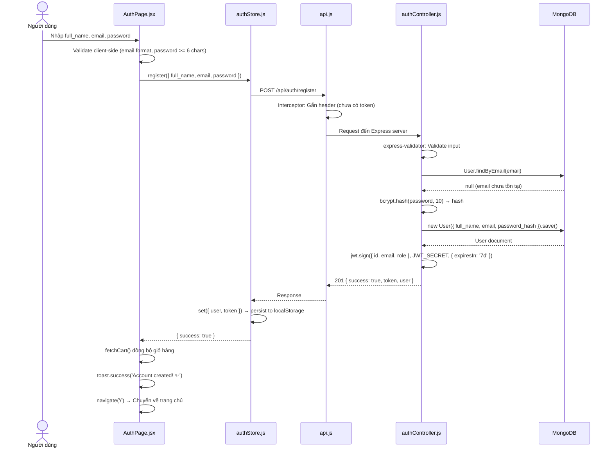
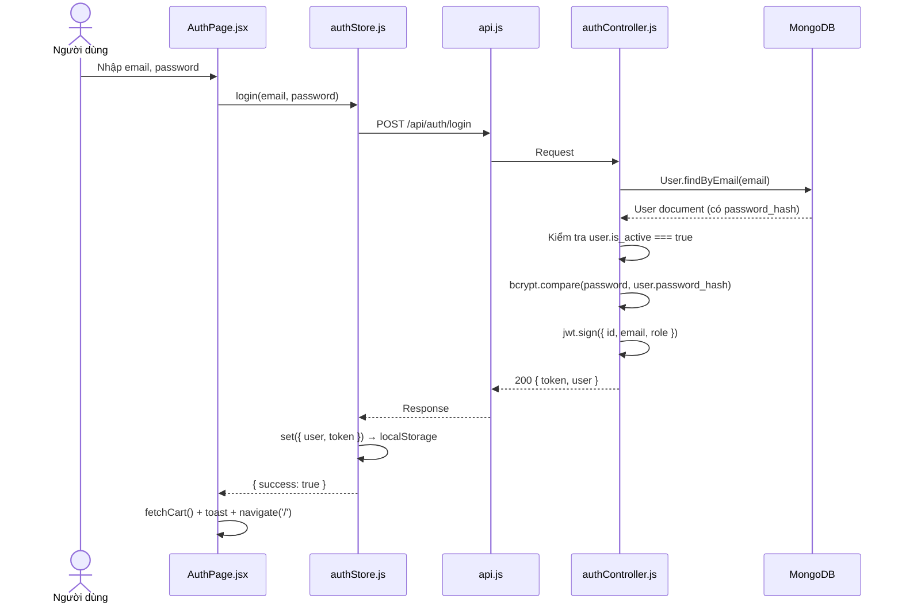
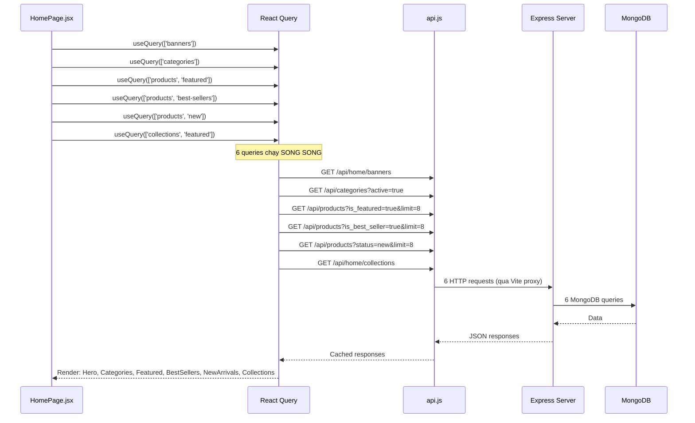
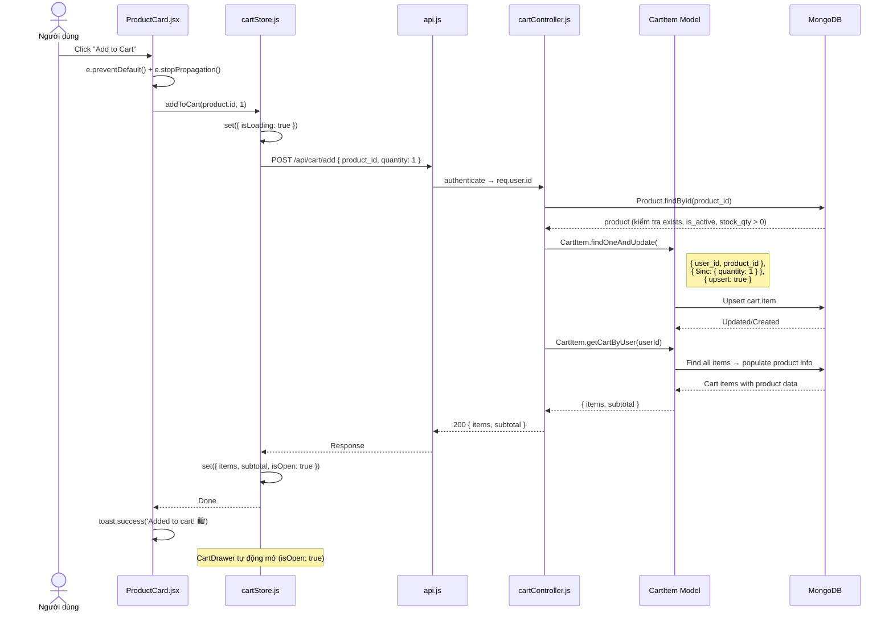
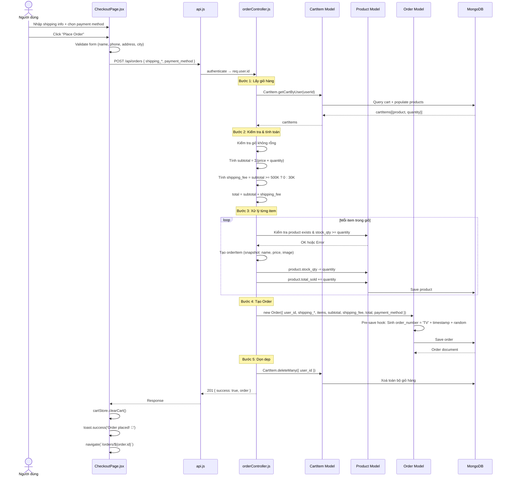
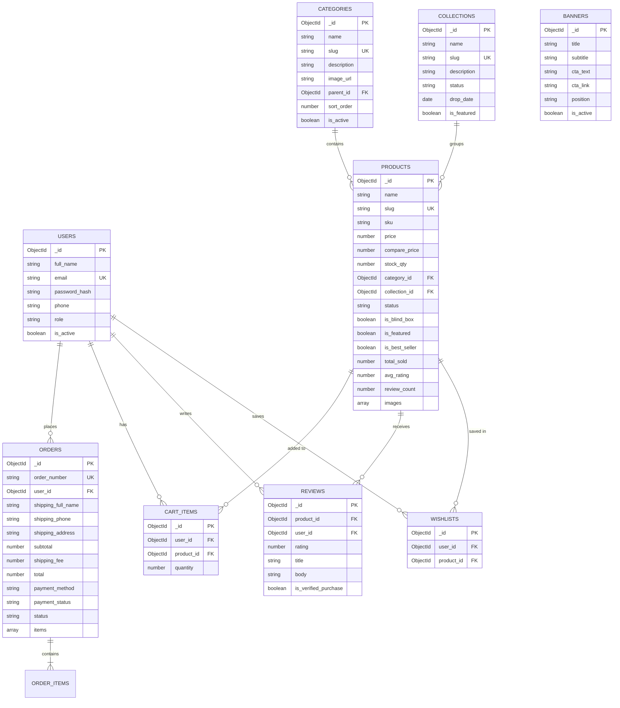

# 📋 BÁO CÁO CHI TIẾT DỰ ÁN TOYVERSE — PHẦN 4: LUỒNG HOẠT ĐỘNG & DATABASE

## 1. Luồng Đăng Ký & Đăng Nhập (Authentication Flow)

### 1.1. Đăng ký (Register)



### 1.2. Đăng nhập (Login)



### 1.3. Luồng Token qua các request sau:

```
Mỗi request tiếp theo:
1. Zustand store → lấy token từ state (đã persist)
2. Axios interceptor → gắn header: Authorization: Bearer <token>
3. Express middleware authenticate:
   a. Parse header → lấy token
   b. jwt.verify(token, JWT_SECRET) → decoded = { id, email, role }
   c. req.user = decoded → Gắn user info vào request
   d. next() → Cho controller xử lý
```

---

## 2. Luồng Duyệt Sản Phẩm (Product Browsing)

### 2.1. Trang chủ (HomePage)



### 2.2. Trang Shop (Filter + Search + Pagination)

```
URL: /shop?category=figures&status=hot&sort=price_asc&min_price=100000&page=2&q=bear

ShopPage.jsx
    │
    ├── useSearchParams() ← Đọc filters từ URL
    │
    ├── useQuery(['products', filters])
    │       → GET /api/products?category=figures&status=hot&sort=price_asc&min_price=100000&page=2&q=bear&limit=16
    │       → productController.getAll(req.query)
    │       → Product.getAll(filters):
    │           1. Build MongoDB query:
    │              { is_active: true, status: 'hot', price: { $gte: 100000 } }
    │              + Find category by slug 'figures' → get ObjectId
    │              + $text search: 'bear'
    │           2. Sort: { price: 1 } (price_asc)
    │           3. Skip: (2-1) * 16 = 16
    │           4. Limit: 16
    │           5. Populate: category_id → { name, slug }
    │           6. Return: { rows, total, page, totalPages }
    │
    ├── Render ProductCard grid/list
    │
    └── setFilter(key, value) → setSearchParams(newURL)
            → URL thay đổi → React Query re-fetch
```

---

## 3. Luồng Giỏ Hàng (Cart Flow)

### 3.1. Thêm vào giỏ



### 3.2. Cập nhật số lượng

```
CartDrawer / CartPage  →  updateQuantity(product_id, newQty)
    → PUT /api/cart/update { product_id, quantity: newQty }
    → cartController.updateItem:
        Nếu qty < 1 → Xoá item
        Nếu qty >= 1 → Update quantity
    → Trả về giỏ hàng mới
    → set({ items, subtotal })
```

---

## 4. Luồng Đặt Hàng (Order Flow) — LUỒNG QUAN TRỌNG NHẤT



**Các bước bảo vệ:**
1. ✅ Kiểm tra user đã đăng nhập (authenticate middleware)
2. ✅ Kiểm tra giỏ hàng không rỗng
3. ✅ Kiểm tra sản phẩm tồn tại & đang active
4. ✅ Kiểm tra đủ tồn kho (stock_qty >= quantity)
5. ✅ Snapshot thông tin sản phẩm tại thời điểm mua (tên, giá, ảnh)
6. ✅ Trừ tồn kho ngay sau khi tạo order

---

## 5. Luồng Quản Lý Admin

### 5.1. Dashboard Stats

```
AdminDashboard.jsx
    → useQuery(['admin-stats']) → GET /api/admin/stats
    → adminController.getStats():
        → Promise.all([
            Product.countDocuments(),            // total_products
            Order.countDocuments(),              // total_orders
            User.countDocuments({ role: 'user' }), // total_users
            Order.aggregate([{ $match: { status: { $ne: 'cancelled' } } },
                             { $group: { _id: null, total: { $sum: '$total' } } }]),  // total_revenue
            Order.find().sort(-created_at).limit(8).populate('user_id'),  // recent_orders
            Product.getTopSelling(6),            // top_products
            Order.aggregate([
              { $match: { created_at >= 12 months ago } },
              { $group: { _id: yearMonth, revenue: $sum: '$total' } }
            ]),  // monthly_revenue
          ])
```

### 5.2. CRUD Sản phẩm

```
Tạo sản phẩm:
AdminProducts → Click "Add Product" → Modal mở
    → Nhập form: name, category, price, stock, status, images...
    → Submit → FormData (multipart/form-data)
        → POST /api/products
            → authenticate + requireAdmin
            → upload.array('images', max 10)     → Multer lưu ảnh
            → productController.create
                → Tạo slug từ name
                → Xử lý images array
                → new Product({...}).save()
    → onSuccess → invalidateQueries(['admin-products']) → re-fetch list

Sửa sản phẩm:
AdminProducts → Click Edit icon → Modal mở (pre-filled)
    → Sửa form → Submit → PUT /api/products/:id → update
    → Có thể upload thêm ảnh mới

Xoá sản phẩm:
AdminProducts → Click Delete icon → window.confirm()
    → DELETE /api/products/:id → xoá khỏi MongoDB
```

---

## 6. Luồng Wishlist

```
ProductCard / ProductDetailPage
    │
    ├── Click ❤️ Wishlist button
    │       → userService.toggleWishlist(product_id)
    │       → POST /api/users/wishlist/toggle { product_id }
    │       → authenticate middleware
    │       → userController.toggleWishlist:
    │           Kiểm tra đã có trong wishlist?
    │           ├── Có → Xoá khỏi wishlist → { added: false }
    │           └── Chưa → Thêm vào wishlist → { added: true }
    │       → toast: "❤️ Added!" hoặc "💔 Removed!"
    │
    └── WishlistPage
            → useQuery(['wishlist']) → GET /api/users/wishlist
            → Wishlist.getByUser(userId) → populate product info
            → Hiển thị ProductCard grid
```

---

## 7. Luồng Review Sản phẩm

```
ProductDetailPage → Tab "Reviews"
    │
    ├── Xem reviews:
    │       → useQuery(['reviews', productId])
    │       → GET /api/products/:id/reviews
    │       → reviewController.getByProduct
    │       → Review.find({ product_id }) + aggregate stats (avg, count)
    │
    └── Viết review (link tới form, nếu authenticated):
            → POST /api/products/:id/reviews { rating, title, body }
            → authenticate middleware
            → reviewController.create:
                1. Kiểm tra đã review chưa → 409 Conflict
                2. Kiểm tra verified purchase:
                   → Order.findOne({ user_id, 'items.product_id': productId, status: 'completed' })
                   → is_verified_purchase = !!order
                3. Tạo Review → save
                4. Cập nhật Product: avg_rating, review_count
                   → Review.aggregate([ { $match }, { $group: { avg, count } } ])
                   → Product.findByIdAndUpdate(productId, { avg_rating, review_count })
```

---

## 8. Database Schema (MongoDB)

Mặc dù dự án dùng MongoDB, file `database/schema.sql` chứa thiết kế ban đầu (MySQL) dùng làm tham chiếu. Mongoose Models đã chuyển đổi sang NoSQL.

### 8.1. Entity-Relationship Diagram



### 8.2. Bảng tổng hợp Database

| Collection | Mô tả | Các field quan trọng | Quan hệ |
|---|---|---|---|
| **users** | Người dùng | email (unique), password_hash, role | → orders, cart_items, reviews, wishlists |
| **categories** | Danh mục | slug (unique), parent_id | → products |
| **collections** | Bộ sưu tập | slug, status, drop_date | → products |
| **products** | Sản phẩm | slug, price, stock_qty, category_id, images[] | → cart_items, order_items, reviews |
| **cart_items** | Giỏ hàng | user_id + product_id (unique) | ← users, ← products |
| **orders** | Đơn hàng | order_number, user_id, items[], status | ← users |
| **reviews** | Đánh giá | user_id + product_id (unique), rating 1-5 | ← users, ← products |
| **wishlists** | Yêu thích | user_id + product_id (unique) | ← users, ← products |
| **banners** | Banner quảng cáo | position, is_active, start/end_date | (standalone) |

---

## 9. Design System (CSS Global)

File `src/index.css` (700+ dòng) định nghĩa toàn bộ design system:

### Color Palette
```css
--color-primary:       #F9A8C9   /* Pink pastel */
--color-primary-dark:  #E78BA9   /* Pink đậm */
--color-accent:        #C9B8FF   /* Lavender */
--color-success:       #6BCB8B   /* Green */
--color-warning:       #FFB347   /* Orange */
--color-danger:        #FF6B6B   /* Red */
--color-bg:            #FFFAF7   /* Cream warm */
--color-bg-white:      #FFFFFF
--color-bg-soft:       #FFF5F0   /* Light peach */
--color-text:          #2D2A32   /* Near black */
--color-text-muted:    #8B8494   /* Gray */
```

### Typography
```css
--font-body:    'Nunito', sans-serif     /* Body text */
--font-display: 'Outfit', sans-serif     /* Headings */
--text-xs: 0.75rem      /* 12px */
--text-sm: 0.875rem     /* 14px */
--text-base: 1rem       /* 16px */
--text-lg: 1.125rem     /* 18px */
--text-xl: 1.25rem      /* 20px */
--text-2xl: 1.5rem      /* 24px */
--text-3xl: 2rem        /* 32px */
--text-4xl: 2.5rem      /* 40px */
```

### Components có sẵn
- `.btn` — Buttons: primary, outline, ghost, dark, icon (+ sizes sm, lg, xl)
- `.badge` — Badges: pink, lavender, green, yellow, peach, dark, blue
- `.form-group / .form-input` — Form elements
- `.container` — Responsive container (1200px max)
- `.product-grid` — CSS Grid auto-fill 4 columns
- `.skeleton` — Loading skeleton animation
- `.section` — Section với padding vertical
- `.fade-in-up` — CSS animation hiệu ứng xuất hiện

---

## 10. Tổng kết kỹ thuật

| Khía cạnh | Chi tiết |
|---|---|
| **Kiến trúc** | SPA (React) + RESTful API (Express) + MongoDB |
| **Xác thực** | JWT token (7 ngày), bcrypt hash, role-based access |
| **State** | Zustand (persist) cho auth & cart, React Query cho server data |
| **Routing** | React Router v6 (nested routes, protected routes) |
| **Styling** | CSS Modules + Global CSS variables (design system) |
| **Upload** | Multer (disk storage) + static file serving |
| **Search** | MongoDB Full-Text Search ($text) |
| **Pagination** | Cursor-based (skip/limit) |
| **Validation** | express-validator (server) + client-side validation |
| **Error handling** | Centralized error handler middleware |
| **Security** | Helmet, Rate Limiting, CORS, JWT verification |
| **Caching** | React Query (60s stale time) |
